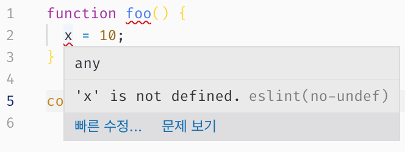

# 20장 strict mode

## strict mode란?

- ES5부터 추가
- 한국어로 **엄격 모드**라고 부름
- 자바스크립트 언어의 문법을 좀 더 엄격하게 적용하여 오류를 발생시킬 가능성이 높거나 자바스크립트 엔진의 최적화 작업에 문제를 일으킬 수 있는 코드에 대해 명시적인 에러를 발생시킴
- 오타나 문법 오류 처럼 사소한 실수에 의한 잠재적인 오류를 발생시키기 어려운 개발환경을 만들고, 그 환경에서 안정적인 코드를 생성하여 개발하려는 것이 목적
- ESlint 같은 린트 도구를 사용해도 유사한 효과를 얻을 수 있다.
- ES6에서 도입된 클래스와 모듈은 기본적으로 strict mode가 적용된다.
- IE9 이하는 지원하지 않는다.

### example)

**자바스크립트의 암묵적 전역**

```jsx
function foo() {
  x = 10;
}

console.log(x); // 10
```

- x를 선언하지 않았지만 `스코프 체인` 을 통해 x 변수가 어디에서 선언되었는지 검색
    1. foo 함수의 스코프에서 x 변수의 선언을 검색 → 실패
    2. foo 함수 컨텍스트의 상위 스코프(위 예제에서는 전역 스코프)에서 x 변수 선언을 검색 → 실패
    3. 자바스크립트는 ReferenceError를 발생시키지 않고 전역 객체에 x프로퍼티를 동적 생성 → 이를 **암묵적 전역** 이라고 부른다.
- 암묵적 전역은 개발자의 의도와 상관없는 에러를 일으킬 확률이 크므로 **let, var, const** 키워드를 사용하여 변수를 선언한 다음 사용을 해야 함
- 또한 **strict mode**를 사용하여 오류를 방지할 수 있음

> **린트 도구**
>
> `정적 분석(static analysis)`  기능을 통해 소스코드를 실행하기 전에 소스코드를 스캔하여 문법적 오류만이 아니라 잠재적 오류까지 찾아내고 오류의 원인을 리포팅 해주는 도구.
> 
> 대표적으로 ESlint가 있다.
> 
> 
> 
> 

## strict mode의 적용

- 전역의 선두 또는 함수 몸체의 선두에 `'use strict';` 를 추가한다. 전역에 추가하면 스크립트 전체에 strict mode가 적용된다.

```jsx
// 전역에 strict mode의 적용하는 것은 바람직하지 않다!
'use strict';

function foo() {
  x = 10; // ReferenceError: x is not defined
}
foo();
```

- 함수 몸체의 선두에 추가하면 해당 함수와 중첩 함수에 strict mode가 적용된다.

```jsx
// 함수 단위로 strict mode 적용
function foo() {
  'use strict';

  x = 10; // ReferenceError: x is not defined
}
foo();
```

- 코드의 선두에 `‘use strict’;` 를 위치시키지 않으면 엄격 모드가 제대로 동작하지 않는다.

```jsx
function foo() {
  x = 10; // 에러를 발생시키지 않는다.
  'use strict';
}
foo();
```

## strict mode의 올바른 사용법

- 전역에 strict mode 를 사용하는 경우 → 권장하지 않음
    - 전역에 적용한 script mode는 스크립트 단위로 적용됨
    - 아래 예제를 보면 strict mode를 사용한 script가 다른 script에는 영향을 주지 않고 있음을 알 수 있음
    
    ```html
    <!DOCTYPE html>
    <html>
    <body>
      <script>
        'use strict';
      </script>
      <script>
        x = 1; // 에러가 발생하지 않는다.
        console.log(x); // 1
      </script>
      <script>
        'use strict';
    
        y = 1; // ReferenceError: y is not defined
        console.log(y);
      </script>
    </body>
    </html>
    ```
    
    - 하지만 strict mode 와 non-strict mode 스크립트를 혼용하는 것은 오류를 발생시킬 수 있다.
    - 특히 외부 서드파티 라이브러리를 사용하는 경우 라이브러리가 non-script인 경우도 있기 때문에 전역에 strict mode를 사용하면 라이브러리 사용 시 에러를 발생시킬 수 있으므로, 이러한 경우 스**크립트 전체를 즉시실행함수로 감싸서 스코프를 구분하고 즉시 실행함수의 선두에 strict mode를 적용할 것을 권장**
- 함수 단위로 strict mode를 사용하는 경우 → 권장하지 않음
    - strict mode를 사용하는 함수와 사용하지 않는 함수를 혼용하는 것 역시 바람직하지 않다.
    - 특히 strict mode가 적용된 함수가 참조할 함수 외부의 컨텍스트에 strict mode를 적용하지 않는 경우도 문제가 생길 수 있다.
    
    ```jsx
    (function () {
      // non-strict mode
      var lеt = 10; // 에러가 발생하지 않는다.
    
      function foo() {
        'use strict';
    
        let = 20; // SyntaxError: Unexpected strict mode reserved word
      }
      foo();
    }());
    ```
    

- 권장되는 방법: **즉시실행함수로 감싼 스크립트 단위로 사용**

```jsx
// 즉시실행 함수에 strict mode 적용
(function () {
  'use strict';

  // Do something...

}());
```

## strict mode가 발생시키는 에러

### 1. 암묵적 전역

- 선언하지 않는 변수를 참조하면 **ReferenceError**가 발생

```jsx
(function () {
  'use strict';

  x = 1;
  console.log(x); // ReferenceError: x is not defined
}());
```

### 2. 변수, 함수, 매개변수의 삭제

- `delete` 연산자로 변수, 함수, 매개변수를 삭제하면 **SyntaxError**가 발생

```jsx
(function () {
  'use strict';

  var x = 1;
  delete x;
  // SyntaxError: Delete of an unqualified identifier in strict mode.

  function foo(a) {
    delete a;
    // SyntaxError: Delete of an unqualified identifier in strict mode.
  }
  delete foo;
  // SyntaxError: Delete of an unqualified identifier in strict mode.
}());
```

### 3. 매개변수 이름의 중복

- 중복된 매개변수 이름을 사용하면 **SyntaxError**가 발생

```jsx
(function () {
  'use strict';

  //SyntaxError: Duplicate parameter name not allowed in this context
  function foo(x, x) {
    return x + x;
  }
  console.log(foo(1, 2));
}());
```

### 4. with문의 사용

- with 문을 사용하면 SyntaxError가 발생
- with문은 전달된 객체를 스코프 체인에 추가하는 역할
    - 동일한 객체의 프로퍼티를 반복해서 사용할 때 객체 이름을 생략할 수 있어 코드가 간단해지는 효과가 있음
    - 그러나 성능과 가독성이 나빠진다는 단점이 있으므로 사용하지 않는 것을 권장

```jsx
(function () {
  'use strict';

  // SyntaxError: Strict mode code may not include a with statement
  with({ x: 1 }) {
    console.log(x);
  }
}());
```

## strict mode 적용에 의한 변화

### 일반 함수의 this

- strict mode에서 함수를 일반 함수로 호출하면 this에 `undefined` 가 바인딩
- 생성자 함수가 아닌 일반 함수 내부에서는 this를 사용할 필요가 없기 때문

```jsx
(function () {
  'use strict';

  function foo() {
    console.log(this); // undefined
  }
  foo();

  function Foo() {
    console.log(this); // Foo
  }
  new Foo();
}());
```

### arguments 객체

- strict mode에서는 매개변수에 전달된 인수를 재할당하여 변경해도 arguments 객체에 반영되지 않음

```jsx
(function (a) {
  'use strict';
	
// 매개변수에 전달된 인수를 재할당하여 변경
a = 2;

// 변경된 인수가 arguments 객체에는 반영되지 않는다.
console.log(arguments); // {0: 1, length: 1}
  
}(1));
```


