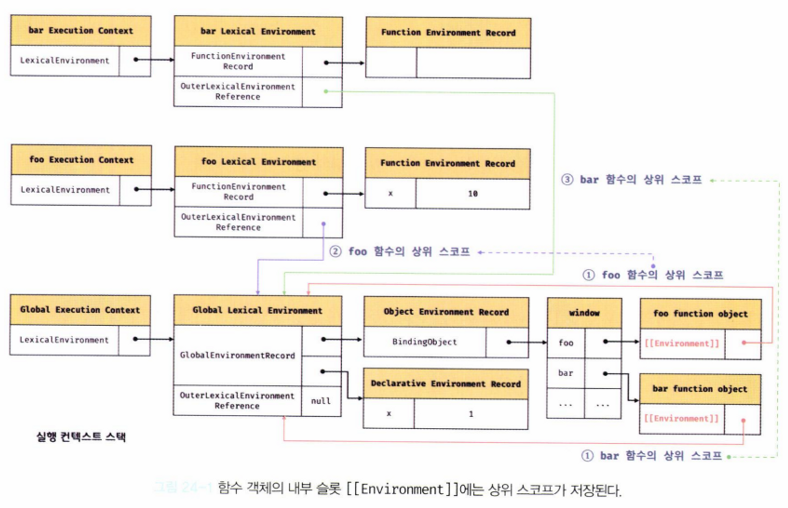
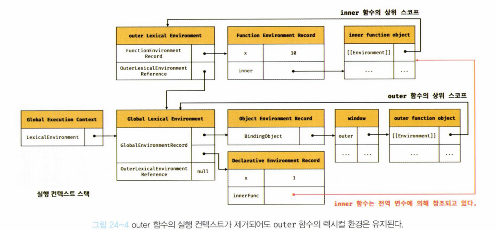
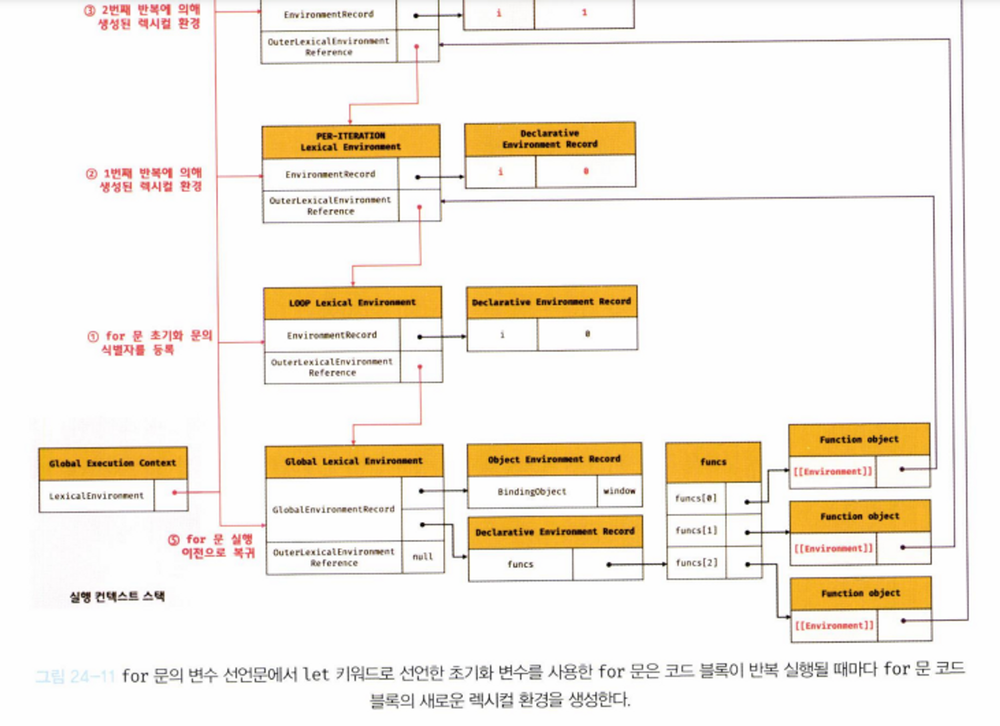

# 24장 클로저

[노션 링크](https://www.notion.so/prgrms/24-18d07125850345ada8af0497695c55f5)


자바스크립트 고유의 개념이 아닌, 함수형 프로그래밍 언어에서 사용되는 중요한 특성

> MDN 문서 정의
>
> “A closure is the combination of a function and the lexical environment within which that function was declared.”
>
> 클로저는 함수와 그 함수가 선언됐을 때의 **렉시컬 환경(Lexical environment)**과의 조합이다.


## 렉시컬 스코프

- 13.5절에서 관련 개념 참조

> 자바스크립트 엔진은 함수를 어디서 호출했는지가 아니라 **함수를 어디에 정의했는지**에 따라 상위 스코프를 결정

```jsx
function outerFunc() {
  var x = 10;
  var innerFunc = function () { console.log(x); };
  innerFunc();
}

outerFunc(); // 10
```

- **동작 과정 상세설명**

  1. 내부함수 innerFunc가 호출되면 자신의 실행 컨텍스트가 실행 컨텍스트 스택에 쌓이고 **변수 객체(Variable Object)와 스코프 체인(Scope chain) 그리고 this에 바인딩할 객체**가 결정된다.
  2. 이때 스코프 체인은 전역 스코프를 가리키는 전역 객체와 함수 outerFunc의 스코프를 가리키는 함수 outerFunc의 **활성 객체(Activation object)** 그리고 함수 자신의 스코프를 가리키는 활성 객체를 순차적으로 바인딩한다. 
  3. 스코프 체인이 바인딩한 객체가 바로 렉시컬 스코프의 실체이다.

  내부함수 innerFunc가 자신을 포함하고 있는 외부함수 outerFunc의 변수 x에 접근할 수 있는 것, 다시 말해 상위 스코프에 접근할 수 있는 것은 렉시컬 스코프의 레퍼런스를 차례대로 저장하고 있는 실행 컨텍스트의 **스코프 체인**을 자바스크립트 엔진이 검색하였기에 가능한 것이다.

  

  좀더 자세히 설명하면 아래와 같다.

  1. innerFunc 함수 스코프(함수 자신의 스코프를 가리키는 활성 객체) 내에서 변수 x를 검색한다. 검색이 실패하였다.
  2. innerFunc 함수를 포함하는 외부 함수 outerFunc의 스코프(함수 outerFunc의 스코프를 가리키는 함수 outerFunc의 활성 객체)에서 변수 x를 검색한다. 검색이 성공하였다.

------

- outerFunc 내부에서 innerFunc 가 정의되었다. → innerFunc를 호출했을 때 자신을 포함하고 있는 outerFunc의 변수 x에 접근이 가능하다.
- innerFunc는 자신이 속한 **렉시컬 스코프(전역, outerFunc, 자신의 스코프)**를 참조 가능
- 스코프의 실체는 실행 컨텍스트의 렉시컬 환경
- 자신의 `외부 렉시컬 환경에 대한 참조(Outer Lexical Environment Reference` 를 통해 상위 렉시컬 환경과 연결 → **스코프 체인**
- `함수의 상위 스코프를 결정한다.` == `렉시컬 환경의 외부 렉시컬 환경에 대한 참조에 저장할 참조값을 결정한다.`

**정리**

> 렉시컬 환경의 `외부 렉시컬 환경에 대한 참조` 에 저장할 참조값, 즉 상위 스코프에 대한 참조는 함수 정의가 평가되는 시점에 함수가 정의된 환경(위치)에 의해 결정된다. → **렉시컬 스코프**

------

## 함수 객체의 내부 슬릇[[Environment]]

- 함수가 정의된 환경과 호출되는 환경이 다를 수 있기 때문에 렉시컬 스코프가 가능하려면 **함수는 자신이 호출되는 환경과 상관없이 자신이 정의된 환경, 즉 상위 스코프(함수 정의가 위치하는 스코프)를 기억해야 한다,**

→ 이를 위해 함수는 자신의 **내부 슬릇 [[Environment]] 에 자신이 정의된 환경, 즉 상위 스코프의 참조를 저장**

```jsx
const x = 1;

function foo(){
	const x = 10;

// 상위 스코프는 함수 정의 환경에 따라 결정
// 함수 호출 위치와 상위 스코프는 아무런 관련이 없다.
bar();
}

// 함수 bar는 자신의 상위 스코프, 즉 전역 렉시컬 환경을 [[Environment]] 에 저장하여 기억한다.
function bar(){
 console.log(x)
}

foo() // 1
bar() // 1
```



- 내부 슬롯 [[Environment]] 에 저장된 상위 스코프의 참조는 **현재 실행 중인 실행 컨텍스트의 렉시컬 환경을 가리킨다.**

  - foo 함수의 외부 렉시컬 환경에 대한 참조는 전역 렉시컬 환경
  - bar 함수의 외부 렉시컬 환경에 대한 참조도 전역 렉시컬 환경
  - foo 함수와 bar 함수는 모든 전역 코드가 평가되는 시점에 평가되어 함수 객체를 생성하고 **전역 객체 window의 메서드**가 된다.
  - 생성된 함수 객체(foo, bar)의 내부 슬롯 **[[Environment]]**에는 함수 정의가 평가된 시점, 즉 전역 코드 평가 시점에 실행 중인 실행 컨텍스트의 렉시컬 환경인 **전역 렉시컬 환경의 참조**가 저장된다.(위 그림에서 1번 과정)

- **함수 코드의 평가 순서**

  함수가 호출되면 함수 내부로 코드의 제어권이 이동하고 함수 코드를 평가하기 시작

  아래 순서로 함수 코드 평가가 진행된다.

  1. 함수 실행 컨텍스트 생성(Execution context)
  2. 함수 렉시컬 환경 생성(실행 컨텍스트 내부 LexicalEnvironment → 함수 렉시컬 환경 참조)
     1. 함수 환경 레코드(Function Environment Record) 생성 → 변수, 값 저장
     2. this 바인딩
     3. **외부 렉시컬 환경(Out Lexical Environment Reference) 참조** 결정

- **외부 렉시컬 환경에 대한 참조에는 함수 객체의 내부 슬롯 [[Environment]] 에 저장된 렉시컬 환경의 참조가 할당된다.(위 그림의 2번과 3번 과정)**

- 함수 객체는 자신의 **내부 슬롯 [[Environment]]에 저장된 렉시컬 환경의 참조(상위 스코프)**를 **자신이 존재하는 한 기억한다.**

------

## 클로저와 렉시컬 환경

- 외부 함수보다 중첩 함수가 더 오래 유지되는 경우, 

  중첩 함수는 이미 생명 주기가 종료하여 실행 컨텍스트에서 제거된 외부 함수의 변수를 참조할 수 있다.

   → 

  이러한 상황에서의 중첩 함수를 클로저(Closure)라고 부른다.

  - 중첩 함수의 생명 주기가 외부 함수보다 더 오래 유지되어 외부 함수의 식별자를 참조하는 경우, 이 중첩 함수가 바로 클로저이다.

```jsx
const x = 1;

function outer(){
	const x = 10;
	const inner = function(){ console.log(x); };
	return inner;
}

const innerFunc = outer();
innerFunc(); // 10
```

1. outer 함수를 호출하면, 중첩 함수 inner를 반환하고 실행컨텍스트에서 제외된다.
2. 반환된 inner 함수를 호출하면, inner 함수 정의 당시에 환경을 기억하여 외부 함수의 지역 변수 x를 참조 → 10 출력

**[과정 설명]**



outer 함수가 호출되어 inner 함수를 반환하였을 때, **실행 컨텍스트에서 제거되지만 outer 함수의 렉시컬 환경까지 소멸하진 않는다.**

→ inner 함수는 호출되어 자신이 평가될 때, 자신이 기억하는 상위 스코프 outer 함수 렉시컬 환경을 [[Environment]] 내부 슬롯에 저장

→ 이때 저장된 상위 스코프는 함수가 존재하는 한 유지된다.

→ outer 함수의 렉시컬 환경은 **inner 함수의 [[Environment]] 내부 슬릇에 의해 계속 참조되고 있고, inner 함수는 변수 innerFunc에 의해 참조되고 있으므로 가비지 컬랙션의 대상이 되지 않는다.**

→ innerFunc가 호출되어 자신이 참조하고 있는 상위 스코프의 식별자 x를 출력

→ 자신의 스코프에는 x가 없으므로 검색 실패

→ 스코프 체인을 따라 상위 스코프로 변수 x를 검색하고, 값 10을 출력

------

- 자바스크립트의 모든 함수는 자신의 상위 스코프를 기억한다.(자바스크립트 엔진이 렉시컬 스코프를 따르기 때문)
- 함수는 어디서 호출하든 상관없이 언제나 자신이 기억하는 상위 스코프의 식별자를 참조할 수 있고, 해당 식별자에 바인딩된 값을 참조 및 변경할 수 있다.
  - 클로저에 의해 참조되는 상위 스코프의 변수를 **자유 변수(free variable)**라고 부른다.
  - 최적화된 모던 자바스크립트 엔진은 **클로저가 참조하고 있지 않는 식별자는 기억하지 않는다.** → 기억해야할 식별자만 기억하므로 메모리 낭비가 일어나지 않는다.
- 이론적으로 자바스크립트의 모든 함수는 상위 스코프를 참조하고 기억하므로 클로저이지만, 모든 함수를 클로저라고 부르지는 않는다.
  - 상위 스코프의 어떤 식별자도 참조하지 않는 경우, 모던 브라우저는 최적화를 통해 상위 스코프를 기억하지 않는다. → **클로저가 아니다.**
  - 상위 스코프의 식별자를 참조하더라도 중첩 함수가 외부 함수보다 생명이 오래 유지되지 않는다. → **클로저가 아니다.**

→ 클로저는 **(1) 중첩 함수가 상위 스코프의 식별자를 참조하고 있고, (2) 중첩 함수가 외부 함수보다 오래 유지되는 경우에 한정하는 것이 일반적**


## 클로저의 활용

1. 상태(state)를 안전하게 변경하고 유지하기 위해 사용

   → **상태를 안전하게 은닉(information hiding)**하고 **특정 함수에게만 상태 변경을 허용**

```jsx
const increase = (function(){
	// 카운트 상태 변수
	let num = 0;
	return function(){
		return ++num;
	};
}());

console.log(increase()); // 1
console.log(increase()); // 2
```

- 즉시 실행 함수로 인해 increase 변수에 상태 변수 num을 증가시키는 함수가 반환되어 할당
- increase에 할당된 함수는 자신의 상위 스코프인 즉시 실행 함수의 렉시컬 환경을 기억 → num 변수를 기억함
- 즉시실행함수는 호출 즉시 소멸되지만 즉시실행함수가 반환한 클로저는 즉시실행함수 렉시컬 환경의 변수 num을 어디서든 참조하고 변경 가능

```jsx
const counter = (function(){
	let num = 0;
	// 클로저인 메서드를 프로퍼티로 갖는 객체 반환
	// 객체 리터럴은 스코프를 만들지 않는다!
	// 아래 메서드들의 상위 스코프는 즉시 실행 함수의 렉시컬 환경
	return {
		increase(){
			return ++num;
		},
		decrease(){
			return num > 0 ? --num : 0;
		}
	}
}());

console.log(counter.increase()); // 1
console.log(counter.decrease()); // 0
```

- 객체 리터럴의 중괄호는 코드 블록이 아니기 때문에 별도의 스코프를 생성하지 않는다.

- **생성자 함수 버전**

  ```jsx
  const Counter = (function(){
  	let num = 0;
  
  	function Counter(){}
  	Counter.prototype.increase = function(){
  		return ++num;
  	}
  	Counter.prototype.decrease = function(){
  	return num > 0 ? --num : 0;
  }
  return Counter;
  }())
  
  const counter = new Counter();
  
  console.log(counter.increase()); // 1
  console.log(counter.decrease()); // 0
  ```

  - 만약 변수 num이 즉시실행함수가 아닌 생성자 함수 Counter 내부에 선언된 프로퍼티가 되면, num은 Counter가 생성할 인스턴스의 내부 프로퍼티가 되므로 외부의 접근이 자유로운 public 프로퍼티가 된다.
  - 그러나 즉시실행함수에서 선언된 num은 Counter 인스턴스를 통해 접근이 불가능하고, i**ncrease와 decrease 메소드로만 값을 변경할 수 있다.**
  - 생성자 함수 Counter는 프로토타입을 통해 increase, decrease 메서드를 상속받는 인스턴스를 생성한다.
    - increase, decrease 메서드는 함수 정의가 평가되어 함수 객체가 될 때, **실행 중인 실행 컨텍스트인 즉시 실행 함수 실행 컨텍스트의 렉시컬 환경을 기억하는 클로저**
    - 프로토타입을 통해 상속되는 프로토타입 메서드일지라도, 즉시실행함수의 자유 변수 num을 참조할 수 있음

------

1. 캡슐화와 정보 은닉

   > **캡슐화(encapsulation)**
   >
   > 객체의 상태(state)를 나타내는 프로퍼티**와 **프로퍼티를 참조하고 조작할 수 있는 동작(behavior)인 메서드를 하나로 묶는 것
   >
   > 캡슐화는 객체의 특정 프로퍼티나 메서드를 감출 목적으로 사용하기도 하는데, **이를 정보 은닉(information hiding)이라고 한다.**

   - 보통 객체지향언어에서는 public, private, protected와 같은 접근 제한자로 외부에서 참조할 수 있는 범위를 제한할 수 있지만, 자바스크립트는 접근 제한자를 제공하지 않는다.
   - 기본적으로 자바스크립트 객체의 모든 프로퍼티와 메서드는 public

   ```jsx
   function Person(name, age){
   	this.name = name; // public
   	let _age = age; // private
   
   	// 인스턴스 메서드
   	this.sayHi = function(){
   		console.log('Hi! My name is ${this.name}. I am ${_age}');
   	}
   }
   
   const me = new Person('Lee', 20);
   me.sayHi(); // Hi! My name is Lee. I am 20
   console.log(me.name) // Lee
   console.log(me._age) // undefined
   
   const you = new Person('Kim', 30);
   you.sayHi(); // Hi! My name is Kim. I am 30
   console.log(you.name) // Kim
   console.log(you._age) // undefined
   ```

   - 위 예시에서 Person 생성자 함수 내부의 this.name은 외부에서 접근 가능한 public 변수이고, _age는 Person 내부에서만 접근 가능한 private 지역 변수이다.

   - 위 예시 코드의 문제점?

     - 답안

       Person 인스턴스를 생성할 때마다 sayHi 메서드도 인스턴스 메서드이기 때문에 중복 생성된다.

       → 해결책: 프로토타입 메서드 정의

   ------

   문제점을 해결한 코드 1번

   ```jsx
   function Person(name, age){
   	this.name = name; // public
   	let _age = age; // private
   }
   
   // 프로토타입 메서드
   Person.prototype.sayHi = function(){
   	console.log('Hi! My name is ${this.name}. I am ${_age}');
   }
   
   const me = new Person('Lee', 20);
   ```

   - 위 코드의 문제점은?

     - 답안

       프로토타입 메서드로 sayHi를 선언할 경우, _age 변수에 접근이 불가능

   ------

   문제점을 해결한 코드 2번

   ```jsx
   const Person = (function(){
   	let _age = 0 // private
   	
   	// 생성자 함수
   	function Person(name, age){
   		this.name = name;
   		_age = age
   	}
   	
   	Person.prototype.sayHi = function(){
   	console.log('Hi! My name is ${this.name}. I am ${_age}');	
   }
   	
   	// 생성자 함수 반환
   	return Person;
   }())
   
   const me = new Person('Lee', 20);
   me.sayHi(); // Hi! My name is Lee. I am 20
   console.log(me.name) // Lee
   console.log(me._age) // undefined
   
   const you = new Person('Kim', 30);
   you.sayHi(); // Hi! My name is Kim. I am 30
   console.log(you.name) // Kim
   console.log(you._age) // undefined
   ```

   - 위 코드의 문제점은?

     - 답안

       아래와 같이 Person 생성자 함수가 여러 개의 인스턴스를 생성할 경우, _age 변수의 상태가 유지되지 않는다.

       ```jsx
       const me = new Person('Lee', 20);
       me.sayHi(); // Hi! My name is Lee. I am 20
       
       const you = new Person('Kim', 30);
       you.sayHi(); // Hi! My name is Kim. I am 30
       
       you.sayHi(); // Hi! My name is Lee. I am 30
       ```

       - Person.prototype.sayHi 메서드가 단 한번 생성되는 클로저이고 상위 스코프로 즉시실행함수 렉시컬 환경을 기억하고 있으며, 모든 인스턴스가 상속받는 프로토타입 메서드이다.
       - 따라서 인스턴스에 상관없이 하나의 동일한 상위 스코프 렉시컬 환경의 _age 변수를 참조하고 변경이 가능
       - 이처럼 자바스크립트는 정보 은닉을 완전하게 지원하지 않는다. 인스턴스 메서드를 통해 private을 흉내낼 수 있을 뿐이다.
       - 최근에는 클래스에 private 필드를 정의할 수 있는 새로운 표준 사양이 제안되어 최신 브라우저에 이미 구현되었다. → **25.7.4절 private 필드 정의 제안 참조**

## 클로저를 활용할 때, 자주 발생하는 실수

```jsx
var focus = [];

for(var i = 0; i < 3; i++){
	focus[i] = function(){ return i; } 
}

for(var j = 0; j < focus.length; j++){
	console.log(focus[j]())
}

// 출력 결과
// 3
// 3
// 3
```

- var 변수가 함수 레벨 스코프이기 때문에 최종적으로 i에는 3이라는 값이 할당된다.
- 다음과 같이 코드를 수정할 수 있다.

```jsx
var focust = [];

for(var i = 0; i < 3; i++){
	focus[i] = (function(id){
		return function(){
			return id;
		}
	}(i))
}

for(var j = 0; j < focus.length; j++){
	console.log(focus[j]())
}
```

- 즉시실행함수 내부에 선언된 함수는 오로지 즉시실행함수의 렉시컬 환경을 상위 스코프로 기억하고 있으므로 각각의 i를 파라미터로 즉시 실행되었을 때, 해당 i 값을 곧바로 return 한다.

  - 즉시실행함수는 호출 즉시 소멸되기 때문에 다음 반복에서 다른 i가 들어와도 이전에 반환된 id는 그대로 유지된다.(기억하고 있는 상위 스코프가 다름)

- 혹은 변수의 키워드를 `let`으로 바꿔줘도 해결된다.

  - let은 블록 레벨 스코프이기 때문
  - **for문의 코드 블록이 반복 실행될 때마다 for문 코드 블록의 새로운 렉시컬 환경 생성**
  - for 문 코드 블록 내부에서 선언한 함수는 상위 스코프로 for문의 스코프를 기억하고 있으며, 매 반복 실행 때마다 식별자의 값(for문 변수 선언문에서 선언한 초기화 변수 및 for 문 코드 블록 내에서 선언한 지역 변수 등)을 유지해야 한다.

  ```jsx
  const focus = [];
  
  for(let i = 0; i < 3; i++){
  	focus[i] = function(){ return i; } 
  }
  
  for(let j = 0; j < focus.length; j++){
  	console.log(focus[j]())
  }
  
  // 출력 결과
  // 0
  // 1
  // 2
  ```

  